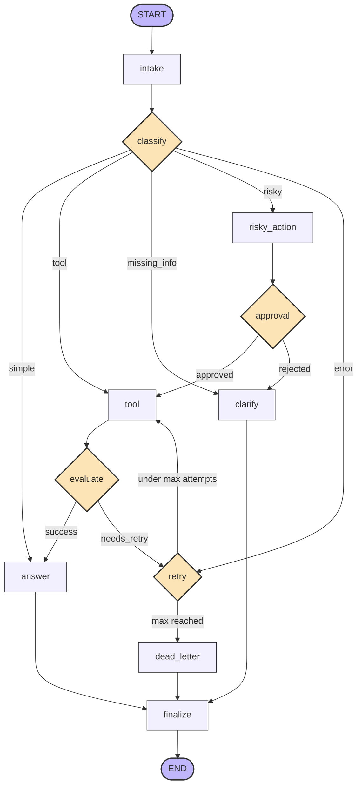

```mermaid
graph TD;
    START([START])
    intake[intake]
    classify{classify}
    answer[answer]
    tool[tool]
    evaluate{evaluate}
    clarify[clarify]
    risky_action[risky_action]
    approval{approval}
    retry{retry}
    dead_letter[dead_letter]
    finalize[finalize]
    END([END])

    START --> intake
    intake --> classify
    
    classify -->|simple| answer
    classify -->|tool| tool
    classify -->|missing_info| clarify
    classify -->|risky| risky_action
    classify -->|error| retry
    
    tool --> evaluate
    evaluate -->|success| answer
    evaluate -->|needs_retry| retry
    retry -->|under max attempts| tool
    retry -->|max reached| dead_letter
    
    risky_action --> approval
    approval -->|approved| tool
    approval -->|rejected| clarify
    
    answer --> finalize
    clarify --> finalize
    dead_letter --> finalize
    finalize --> END

    classDef start_end fill:#bfb6fc,stroke:#333,stroke-width:2px;
    classDef conditional fill:#fce4b6,stroke:#333,stroke-width:2px;
    classDef standard fill:#f2f0ff,stroke:#333,stroke-width:1px;
    
    class START,END start_end;
    class classify,evaluate,approval,retry conditional;
    class intake,answer,tool,clarify,risky_action,dead_letter,finalize standard;
```

